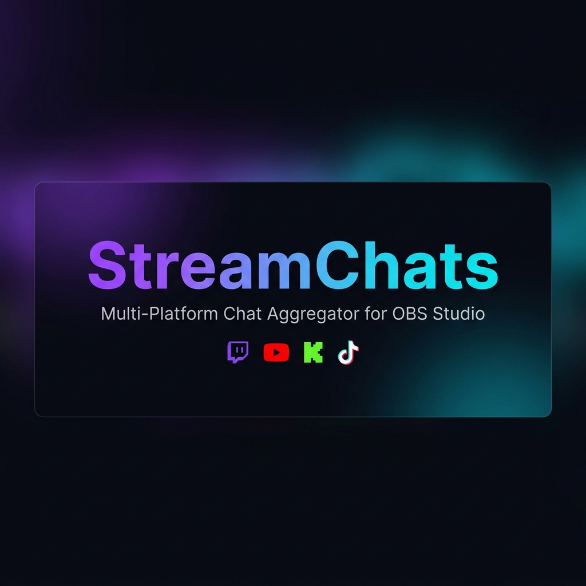
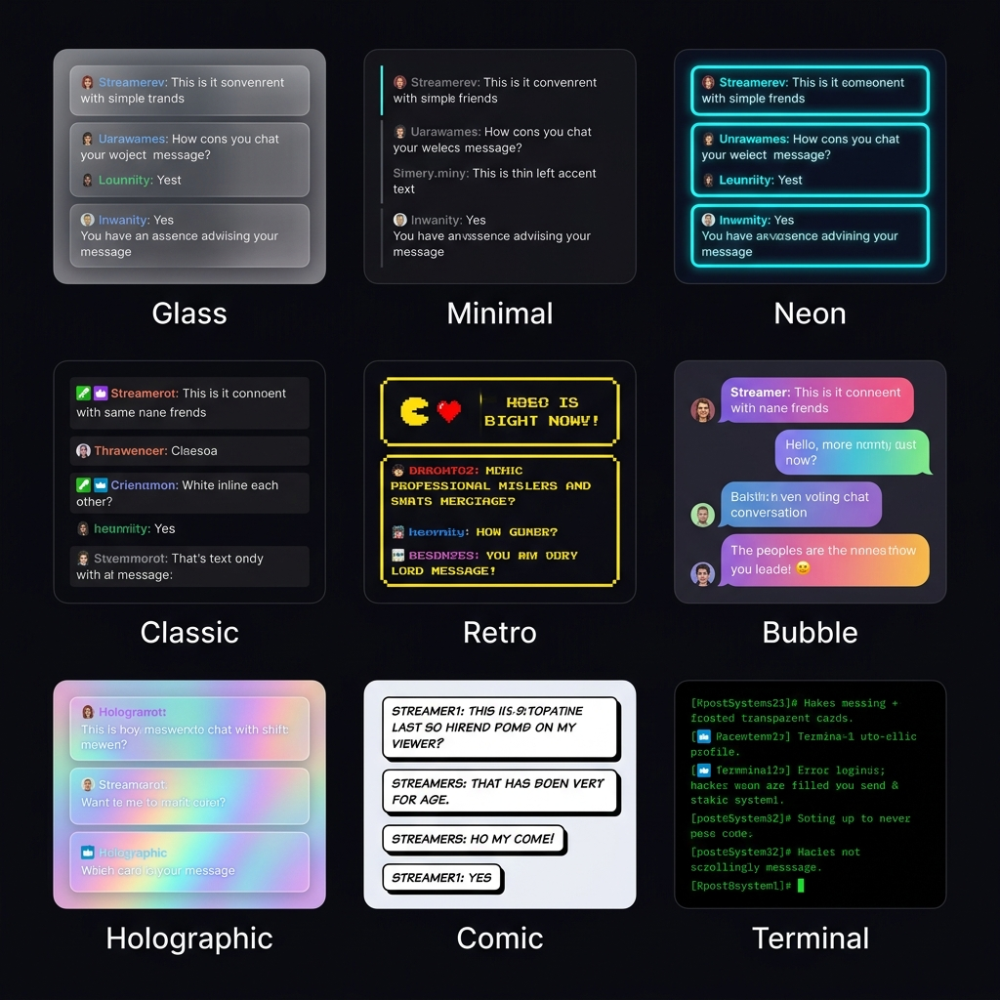
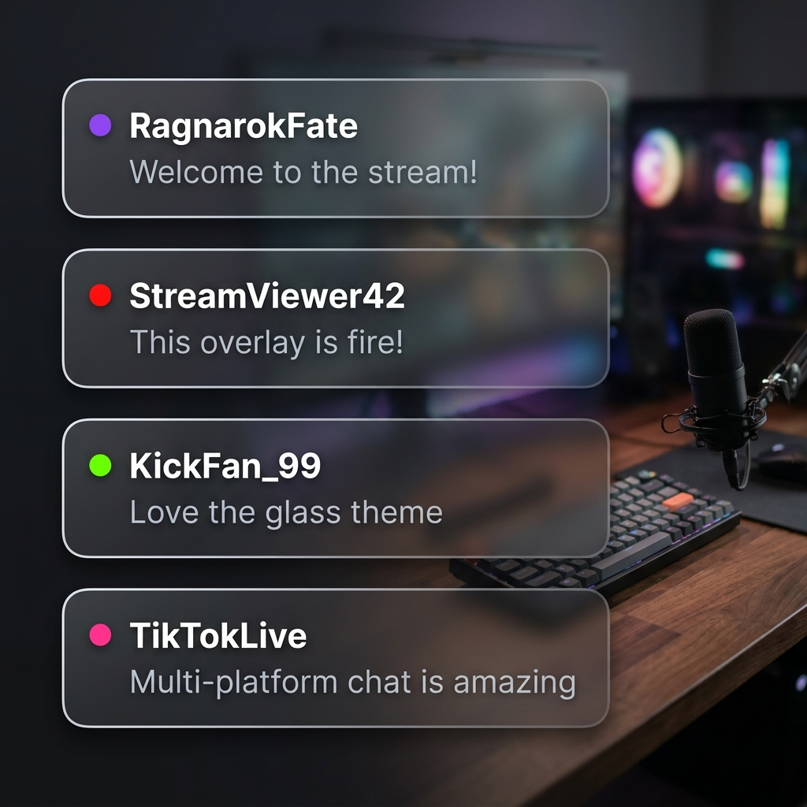
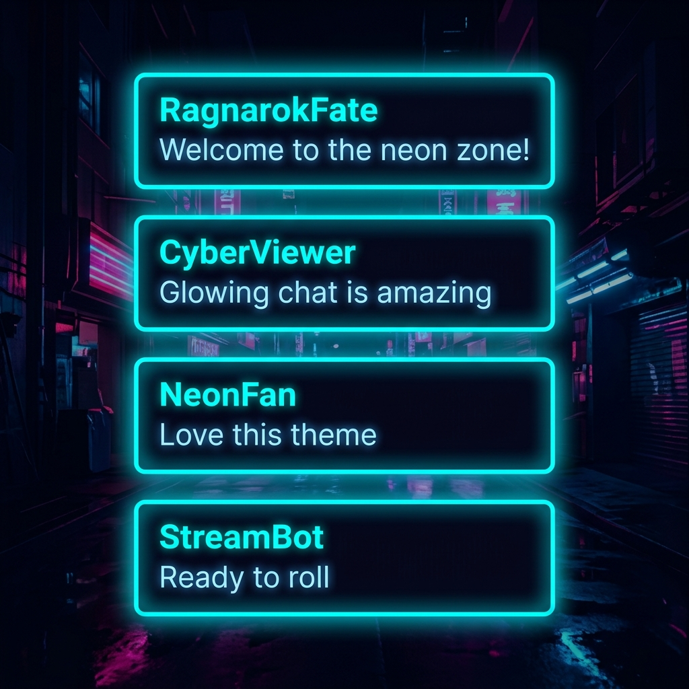
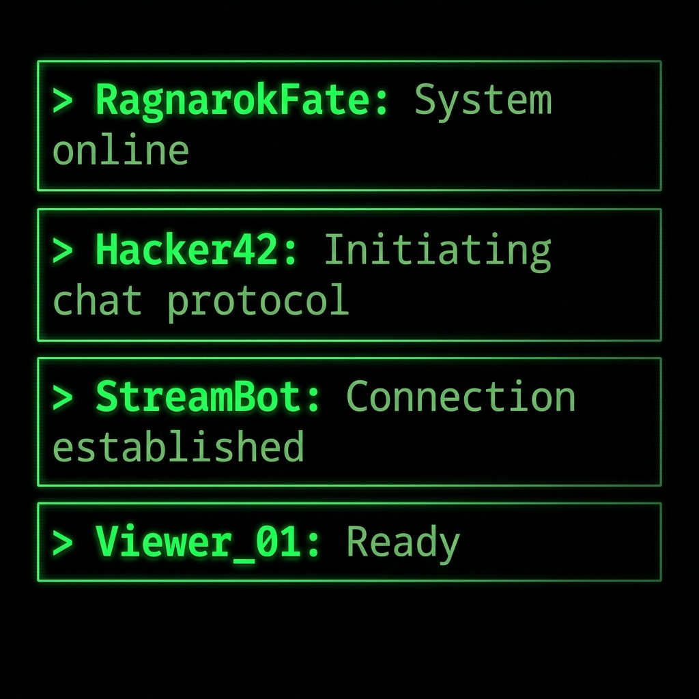

<p align="center">
  
</p>

<p align="center">
  <strong>Aggregate Twitch, YouTube, Kick, and TikTok live chat into a single beautiful overlay for OBS Studio.</strong>
</p>

<p align="center">
  <a href="#-installation"></a>
  <a href="#-license"></a>
  <a href="#-supported-platforms"></a>
  <a href="#-overlay-themes"></a>
</p>

---

## 📖 Table of Contents

- [About](#-about)
- [Key Features](#-key-features)
- [Supported Platforms](#-supported-platforms)
- [Overlay Themes](#-overlay-themes)
- [Architecture](#-architecture)
- [Requirements](#-requirements)
- [Installation](#-installation)
- [Usage](#-usage)
  - [Quick Start (CLI)](#quick-start-cli)
  - [OBS Studio Setup](#obs-studio-setup)
  - [Choosing a Theme](#choosing-a-theme)
- [Project Structure](#-project-structure)
- [Adding a New Platform](#-adding-a-new-platform)
- [Configuration Reference](#-configuration-reference)
- [Known Limitations](#-known-limitations)
- [Contributing](#-contributing)
- [License](#-license)

---

## 🎯 About

**StreamChats** is a modular, open-source chat aggregation engine built for live streamers. It combines chat messages from multiple streaming platforms into a single, real-time overlay that runs directly inside OBS Studio as a Browser Source.

Everything runs **locally on your machine** — no cloud services, no external accounts, no API keys required.

---

## ✨ Key Features

| Feature | Description |
|---------|-------------|
| 🔗 **Multi-Platform Chat** | Aggregate messages from Twitch, YouTube, Kick, and TikTok simultaneously |
| 🎨 **9 Overlay Themes** | From cyberpunk neon to retro pixel art — match your brand |
| 🛡️ **Built-in Moderation** | Profanity filter and banned-word censoring out of the box |
| 🎬 **Native OBS Plugin** | Lua script adds a settings panel directly inside OBS Studio |
| 🏠 **100% Local** | No cloud, no SaaS, no external dependencies |
| ⚡ **Lightweight** | Under 2% CPU overhead — built for marathon sessions |
| 🔌 **Extensible SDK** | Add new platforms with a single `BaseConnector` class |

---

## 📡 Supported Platforms

<table>
<tr>
<td align="center" width="25%">
  <br/>
  <strong>Twitch</strong><br/>
  <sub>IRC WebSocket with full badge and emote support</sub>
</td>
<td align="center" width="25%">
  <br/>
  <strong>YouTube</strong><br/>
  <sub>Live chat polling with Super Chat support</sub>
</td>
<td align="center" width="25%">
  <br/>
  <strong>Kick</strong><br/>
  <sub>Real-time Pusher WebSocket connection</sub>
</td>
<td align="center" width="25%">
  <br/>
  <strong>TikTok</strong><br/>
  <sub>Protobuf WebSocket for chat & gifts</sub>
</td>
</tr>
</table>

---

## 🎨 Overlay Themes

StreamChats ships with **9 beautifully crafted overlay themes**. Select one by appending `?theme=<name>` to the Browser Source URL.

<p align="center">
  
</p>

| Theme | URL Parameter | Description |
|-------|:---:|-------------|
| **Glass** _(default)_ | `?theme=glass` | Premium glassmorphism with frosted blur backgrounds |
| **Minimal** | `?theme=minimal` | Clean, borderless text with subtle left-accent line |
| **Neon** | `?theme=neon` | Cyberpunk with glowing cyan borders and pulse animation |
| **Classic** | `?theme=classic` | Solid opaque blocks, inline Twitch-style format |
| **Retro** | `?theme=retro` | 8-bit pixel art aesthetic with blocky yellow borders |
| **Bubble** | `?theme=bubble` | Rounded iMessage-style bubbles with gradient colors |
| **Holographic** | `?theme=holographic` | Animated iridescent rainbow gradient backgrounds |
| **Comic** | `?theme=comic` | Bold outlines and offset drop shadows, comic book feel |
| **Terminal** | `?theme=terminal` | Green-on-black hacker aesthetic with monospace font |

### Theme Previews

<table>
<tr>
<td align="center" width="33%">
  <br/>
  <strong>Glass</strong>
</td>
<td align="center" width="33%">
  <br/>
  <strong>Neon</strong>
</td>
<td align="center" width="33%">
  <br/>
  <strong>Terminal</strong>
</td>
</tr>
</table>

---

## 🏗️ Architecture

```
┌─────────────────────────────────────────────────────────────┐
│                       OBS Studio                            │
│  ┌────────────────────────┐  ┌────────────────────────────┐ │
│  │   Lua Plugin            │  │   Browser Source            │ │
│  │   (Settings + Spawner)  │  │   (http://localhost:9090)   │ │
│  └───────────┬────────────┘  └───────────▲────────────────┘ │
└──────────────┼───────────────────────────┼──────────────────┘
               │ spawns                    │ WebSocket (ws://)
               ▼                           │
┌──────────────────────────────────────────┐
│          Local Node.js Server            │
│  ┌────────────────────────────────────┐  │
│  │     Moderation Pipeline            │  │
│  │   (filter → censor → broadcast)    │  │
│  └───────────▲────────────────────────┘  │
│              │ normalized ChatEvent      │
│  ┌────────┐ ┌────────┐ ┌──────┐ ┌─────┐ │
│  │ Twitch │ │YouTube │ │ Kick │ │ TT  │ │
│  │  IRC   │ │ Poll   │ │Pusher│ │Proto│ │
│  └────────┘ └────────┘ └──────┘ └─────┘ │
└──────────────────────────────────────────┘
```

**Data flow:**
1. Each **Connector** connects to its platform's chat API and normalizes messages into a `ChatEvent` schema.
2. The **Moderation Pipeline** filters profanity, censors banned words, and manages the chat buffer.
3. The **Local Server** broadcasts events over WebSocket to all connected Browser Sources.
4. The **Overlay UI** (React) renders the chat feed with the selected theme and animations.
5. The **OBS Lua Plugin** spawns the server and provides a UI for configuration.

---

## 📋 Requirements

| Requirement | Version | Notes |
|-------------|---------|-------|
| **Node.js** | v20+ | Required for TikTok connector |
| **npm** | v9+ | Comes bundled with Node.js |
| **OBS Studio** | v28+ | For the Lua plugin and Browser Source |
| **Operating System** | Windows / macOS / Linux | Cross-platform support |

---

## 🚀 Installation

### 1. Clone the Repository

```bash
git clone https://github.com/RagnarokFate/StreamChats.git
cd StreamChats
```

### 2. Install Dependencies

```bash
npm install
```

### 3. Build All Packages

```bash
# Build the shared packages first
npm run build -w packages/event-schema
npm run build -w packages/connector-sdk
npm run build -w packages/moderation-pipeline

# Build connectors
npm run build -w connectors/twitch
npm run build -w connectors/youtube
npm run build -w connectors/kick
npm run build -w connectors/tiktok

# Build the server and UI
npm run build -w apps/local-server
npm run build -w apps/overlay-ui
```

### 4. Verify Installation

```bash
node apps/local-server/dist/index.js --twitch=ragnarokfate --port=9090
```

Open `http://localhost:9090` in your browser — you should see the chat overlay.

---

## 🎮 Usage

### Quick Start (CLI)

Run the local server with your platform channels:

```bash
node apps/local-server/dist/index.js \
  --twitch=ragnarokfate \
  --youtube=@RagnarokFate \
  --kick=ragnarokfate \
  --tiktok=ragnarokfate \
  --port=9090
```

### OBS Studio Setup

#### Step 1: Load the Lua Script
1. Open **OBS Studio** → **Tools** → **Scripts**
2. Click the **+** button
3. Navigate to and select `plugins/obs/obs-chat-aggregator.lua`

#### Step 2: Configure Your Channels
1. In the script properties panel, enter your channel names for **Twitch** and **YouTube**
2. Click the **"Connect / Apply"** button to start the server

#### Step 3: Add the Browser Source
1. In your OBS Scene, click **+** → **Browser**
2. Set the URL to:
   ```
   http://localhost:9090/?theme=glass
   ```
3. Set **Width** to `500` and **Height** to `800` (adjust to your preference)
4. ✅ Check **"Shutdown source when not visible"** to save resources

> **💡 Tip:** The overlay background is fully transparent, so it will blend seamlessly into your stream layout.

### Choosing a Theme

Simply change the `?theme=` parameter in the Browser Source URL:

```
http://localhost:9090/?theme=neon
http://localhost:9090/?theme=terminal
http://localhost:9090/?theme=bubble
```

If no theme is specified, it defaults to `glass`.

---

## 📁 Project Structure

```
StreamChats/
│
├── 📂 apps/
│   ├── local-server/             # Node.js HTTP + WebSocket server
│   │   └── src/index.ts          # CLI entry point, connector orchestration
│   └── overlay-ui/               # React/Vite chat overlay frontend
│       └── src/
│           ├── App.tsx           # Theme router
│           ├── index.css         # All 9 themes
│           └── components/       # ChatFeed, ChatMessage
│
├── 📂 connectors/
│   ├── twitch/                   # Twitch IRC WebSocket connector
│   ├── youtube/                  # YouTube Live Chat polling connector
│   ├── kick/                     # Kick Pusher WebSocket connector
│   └── tiktok/                   # TikTok Live protobuf connector
│
├── 📂 packages/
│   ├── connector-sdk/            # BaseConnector abstract class
│   ├── event-schema/             # Zod schemas (ChatEvent, Platform)
│   └── moderation-pipeline/      # Profanity filter & event router
│
├── 📂 plugins/
│   └── obs/                      # OBS Studio Lua script
│       └── obs-chat-aggregator.lua
│
├── 📂 docs/                      # GitHub Pages landing page
│   ├── index.html
│   ├── styles.css
│   └── images/
│
├── 📂 specs/                     # Feature specifications (001-005)
├── README.md                     # This file
└── package.json                  # Monorepo workspace config
```

---

## 🔌 Adding a New Platform

StreamChats is designed to be easily extensible. To add a new platform connector:

### 1. Create the Package

```bash
mkdir connectors/my-platform/src
```

### 2. Implement the Connector

```typescript
// connectors/my-platform/src/index.ts
import { BaseConnector, ConnectorStatus } from '@obs-chat/connector-sdk';
import crypto from 'crypto';

export class MyPlatformConnector extends BaseConnector {
  protected async connect(): Promise<void> {
    // Connect to the platform's chat API
    // For each incoming message:
    this.dispatchMessage({
      eventId: crypto.randomUUID(),
      platform: 'custom',        // Add to PlatformSchema if needed
      timestamp: new Date().toISOString(),
      type: 'chat',
      author: {
        id: 'user-123',
        name: 'Username',
      },
      message: {
        text: 'Hello world!',
        fragments: [{ type: 'text', text: 'Hello world!' }],
      },
    });

    this.setStatus(ConnectorStatus.CONNECTED);
  }

  protected async disconnect(): Promise<void> {
    // Clean up connections
    this.setStatus(ConnectorStatus.IDLE);
  }
}
```

### 3. Register in the Local Server

Add your connector to `apps/local-server/src/index.ts`:

```typescript
import { MyPlatformConnector } from '@obs-chat/connector-my-platform';

// Inside main():
if (myPlatformChannel) {
  const connector = new MyPlatformConnector({
    platform: 'custom',
    channelId: myPlatformChannel,
  });
  pipeline.addConnector(connector);
  promises.push(connector.start());
}
```

---

## ⚙️ Configuration Reference

### CLI Arguments

| Argument | Description | Example |
|----------|-------------|---------|
| `--twitch=<channel>` | Twitch channel name (without `#`) | `--twitch=ragnarokfate` |
| `--youtube=<handle>` | YouTube channel handle | `--youtube=@RagnarokFate` |
| `--kick=<channel>` | Kick channel name | `--kick=ragnarokfate` |
| `--tiktok=<username>` | TikTok username | `--tiktok=ragnarokfate` |
| `--port=<number>` | Server port (default: `9090`) | `--port=8080` |

### URL Parameters

| Parameter | Description | Example |
|-----------|-------------|---------|
| `theme` | Overlay visual theme | `?theme=neon` |

---

## ⚠️ Known Limitations

| Platform | Limitation |
|----------|------------|
| **Kick** | No official API — uses undocumented Pusher endpoint. May be blocked by Cloudflare in some networks. |
| **TikTok** | No official API — uses `tiktok-live-connector`. Requires Node.js 20+. May require a sign API key for some regions. |
| **YouTube** | Requires an active live stream with **public chat** enabled. |
| **General** | All unofficial platform APIs may break if the platforms change their internal protocols. |

---

## 🤝 Contributing

Contributions are welcome! Here's how you can help:

1. **Fork** the repository
2. **Create** a feature branch (`git checkout -b feat/my-feature`)
3. **Commit** your changes (`git commit -m "feat: add my feature"`)
4. **Push** to the branch (`git push origin feat/my-feature`)
5. **Open** a Pull Request

### Development Setup

```bash
# Clone and install
git clone https://github.com/RagnarokFate/StreamChats.git
cd StreamChats
npm install

# Run the overlay UI in dev mode (hot reload)
npm run dev -w apps/overlay-ui

# Run the local server
node apps/local-server/dist/index.js --twitch=ragnarokfate
```

---

## 📄 License

This project is licensed under the **MIT License** — see the [LICENSE](LICENSE) file for details.

---

<p align="center">
  Built with ❤️ by <a href="https://github.com/RagnarokFate"><strong>RagnarokFate</strong></a>
</p>
