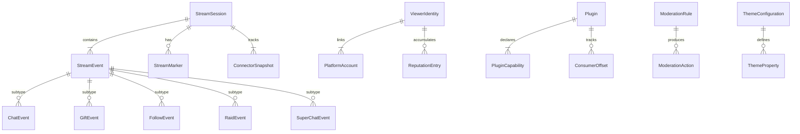

# Data Model: StreamChats Product Roadmap

**Branch**: `007-product-roadmap` | **Date**: 2026-06-27

## Entity Overview



## Core Entities

### StreamEvent (Base)

The foundational event type flowing through the Event Bus.

| Field | Type | Description |
|-------|------|-------------|
| `eventId` | UUID | Unique identifier (used for at-least-once deduplication) |
| `sequenceNumber` | INTEGER | Monotonic auto-increment, assigned by Event Bus on persist |
| `platform` | ENUM | `twitch`, `youtube`, `kick`, `tiktok`, `custom` |
| `type` | ENUM | `chat`, `gift`, `follow`, `raid`, `superchat`, `moderation` |
| `timestamp` | ISO-8601 | Original event timestamp from the platform |
| `sessionId` | UUID | FK → StreamSession, assigned on persist |
| `rawPayload` | JSON | Original platform-specific data (preserved for debugging) |

**Validation**: `eventId` must be unique. `sequenceNumber` is assigned server-side, not by connectors.

**State**: Immutable once persisted. Events are never modified after writing.

### ChatEvent (extends StreamEvent)

| Field | Type | Description |
|-------|------|-------------|
| `author.id` | STRING | Platform-specific user ID |
| `author.name` | STRING | Display name |
| `author.color` | STRING? | Username color (Twitch-specific) |
| `author.badges` | STRING[] | Badge URLs or identifiers |
| `message.text` | STRING | Raw text content |
| `message.fragments` | Fragment[] | Parsed text + emote chunks |
| `moderationStatus` | ENUM | `visible`, `suppressed`, `flagged` (default: `visible`) |
| `toxicityScore` | FLOAT? | 0.0–1.0, set by AI pipeline if enabled |

### GiftEvent (extends StreamEvent)

| Field | Type | Description |
|-------|------|-------------|
| `sender.id` | STRING | Gifter's platform user ID |
| `sender.name` | STRING | Gifter's display name |
| `giftType` | STRING | Platform-normalized gift type (e.g., `sub_gift`, `stars`, `roses`) |
| `giftCount` | INTEGER | Number of gifts in this event |
| `monetaryValue` | OBJECT? | `{ amount: number, currency: string }` if applicable |

### FollowEvent (extends StreamEvent)

| Field | Type | Description |
|-------|------|-------------|
| `follower.id` | STRING | Follower's platform user ID |
| `follower.name` | STRING | Follower's display name |

### RaidEvent (extends StreamEvent)

| Field | Type | Description |
|-------|------|-------------|
| `raider.id` | STRING | Raider's platform user ID |
| `raider.name` | STRING | Raider's display name |
| `viewerCount` | INTEGER | Number of viewers in the raid |

### SuperChatEvent (extends StreamEvent)

| Field | Type | Description |
|-------|------|-------------|
| `sender.id` | STRING | Sender's platform user ID |
| `sender.name` | STRING | Sender's display name |
| `amount` | NUMBER | Monetary value |
| `currency` | STRING | ISO 4217 currency code |
| `message` | STRING? | Optional message text |
| `tier` | STRING? | Platform-specific tier (YouTube color, Twitch sub tier) |

---

### StreamSession

| Field | Type | Description |
|-------|------|-------------|
| `sessionId` | UUID | Primary key |
| `startedAt` | ISO-8601 | Session start timestamp |
| `endedAt` | ISO-8601? | Session end timestamp (null while active) |
| `platforms` | STRING[] | Connected platform names |
| `totalEvents` | INTEGER | Running event count |
| `lastSequenceNumber` | INTEGER | Latest event sequence number |
| `status` | ENUM | `active`, `ended`, `crashed` |

**State transitions**: `active` → `ended` (graceful shutdown) | `active` → `crashed` (abnormal termination, detected on next startup)

**Retention**: Auto-deleted after 14 days (configurable). Associated events cascade-deleted.

### StreamMarker

| Field | Type | Description |
|-------|------|-------------|
| `markerId` | UUID | Primary key |
| `sessionId` | UUID | FK → StreamSession |
| `timestamp` | ISO-8601 | When the marker was placed |
| `label` | STRING? | Optional user-provided label |
| `sequenceNumber` | INTEGER? | Nearest event sequence number at marker time |

---

### ViewerIdentity

| Field | Type | Description |
|-------|------|-------------|
| `identityId` | UUID | Primary key |
| `displayName` | STRING | User-assigned canonical name |
| `reputationScore` | FLOAT | Weighted composite score (0.0–100.0) |
| `reputationWeights` | JSON | Streamer-configured category weights |
| `createdAt` | ISO-8601 | When the identity was first linked |
| `updatedAt` | ISO-8601 | Last reputation recalculation |
| `notes` | STRING? | Streamer's private notes about this viewer |

**Score computation**: `reputationScore = Σ(signal_value × category_weight) / Σ(category_weight)` normalized to 0–100.

### PlatformAccount

| Field | Type | Description |
|-------|------|-------------|
| `accountId` | UUID | Primary key |
| `identityId` | UUID | FK → ViewerIdentity |
| `platform` | ENUM | Platform name |
| `platformUserId` | STRING | Platform-specific user ID |
| `platformUsername` | STRING | Platform display name |
| `linkedAt` | ISO-8601 | When this account was linked |
| `linkMethod` | ENUM | `manual`, `suggested`, `self_claim` |

**Uniqueness**: `(platform, platformUserId)` is unique — one platform account can only belong to one identity.

### ReputationEntry

| Field | Type | Description |
|-------|------|-------------|
| `entryId` | UUID | Primary key |
| `identityId` | UUID | FK → ViewerIdentity |
| `category` | ENUM | `messages`, `gifts`, `watch_time`, `engagement`, `mod_actions`, `spam_flags` |
| `value` | FLOAT | Raw signal value |
| `recordedAt` | ISO-8601 | When this entry was recorded |
| `sessionId` | UUID? | FK → StreamSession (optional context) |

---

### Plugin

| Field | Type | Description |
|-------|------|-------------|
| `pluginId` | STRING | Unique slug (e.g., `tts-reader`) |
| `name` | STRING | Human-readable name |
| `version` | SEMVER | Plugin version |
| `description` | STRING | Brief description |
| `author` | STRING | Plugin author |
| `entryPoint` | PATH | Path to main JS file |
| `status` | ENUM | `installed`, `active`, `disabled`, `error` |
| `installedAt` | ISO-8601 | Installation timestamp |

**State transitions**: `installed` → `active` (user enables) → `disabled` (user disables) | `active` → `error` (crash/timeout)

### PluginCapability

| Field | Type | Description |
|-------|------|-------------|
| `pluginId` | STRING | FK → Plugin |
| `capability` | ENUM | `network`, `filesystem-read`, `filesystem-write`, `notifications`, `overlay-render` |
| `approved` | BOOLEAN | Whether the user approved this capability |
| `approvedAt` | ISO-8601? | When approval was granted |

### ConsumerOffset

| Field | Type | Description |
|-------|------|-------------|
| `consumerId` | STRING | Unique consumer identifier (plugin ID, `overlay`, `analytics`, etc.) |
| `lastSequenceNumber` | INTEGER | Last processed event sequence number |
| `updatedAt` | ISO-8601 | Last offset update timestamp |

---

### ModerationRule

| Field | Type | Description |
|-------|------|-------------|
| `ruleId` | UUID | Primary key |
| `type` | ENUM | `banned_word`, `toxicity_threshold`, `rate_limit`, `shadow_suppress` |
| `config` | JSON | Rule-specific configuration |
| `enabled` | BOOLEAN | Whether this rule is active |
| `priority` | INTEGER | Execution order (lower = first) |
| `createdAt` | ISO-8601 | When the rule was created |

### ModerationAction

| Field | Type | Description |
|-------|------|-------------|
| `actionId` | UUID | Primary key |
| `eventId` | UUID | FK → StreamEvent that triggered this action |
| `ruleId` | UUID | FK → ModerationRule that matched |
| `action` | ENUM | `suppress`, `flag`, `mask`, `drop`, `alert` |
| `timestamp` | ISO-8601 | When the action was taken |

---

### ThemeConfiguration

| Field | Type | Description |
|-------|------|-------------|
| `themeId` | STRING | Unique slug |
| `name` | STRING | Display name |
| `isBuiltIn` | BOOLEAN | Whether it ships with StreamChats |
| `isCustom` | BOOLEAN | Whether it was user-modified |
| `properties` | JSON | Full theme property map |
| `lastModified` | ISO-8601 | Last edit timestamp |

### ThemeProperty

Stored as JSON within `ThemeConfiguration.properties`:

| Key | Type | Description |
|-----|------|-------------|
| `backgroundColor` | COLOR | Overlay background |
| `fontFamily` | STRING | CSS font-family value |
| `fontSize` | NUMBER | Base font size in px |
| `fontWeight` | NUMBER | CSS font-weight |
| `primaryColor` | COLOR | Accent color |
| `borderRadius` | NUMBER | Message bubble radius |
| `animationType` | ENUM | `fade`, `slide`, `none` |
| `animationDuration` | NUMBER | Duration in ms |

---

## Storage Layout

### SQLite Tables (better-sqlite3)

```
stream_events        — All StreamEvent subtypes (single table, discriminated by `type`)
stream_sessions      — Session metadata
stream_markers       — Hotkey-placed markers
viewer_identities    — Cross-platform identity records
platform_accounts    — Linked platform accounts
reputation_entries   — Reputation signal log
moderation_rules     — Active moderation configuration
moderation_actions   — Audit log of moderation decisions
consumer_offsets     — Event Bus consumer position tracking
plugins              — Installed plugin registry
plugin_capabilities  — Per-plugin approved capabilities
```

### Browser localStorage (unchanged from current)

```
streamchats_settings — DashboardSettings (theme, font, timestamps, emotes)
streamchats_theme    — Active ThemeConfiguration properties
```

### Server-side JSON files (unchanged from current)

```
config/server-config.json — ServerConfig (banned words, spam toggle)
```
